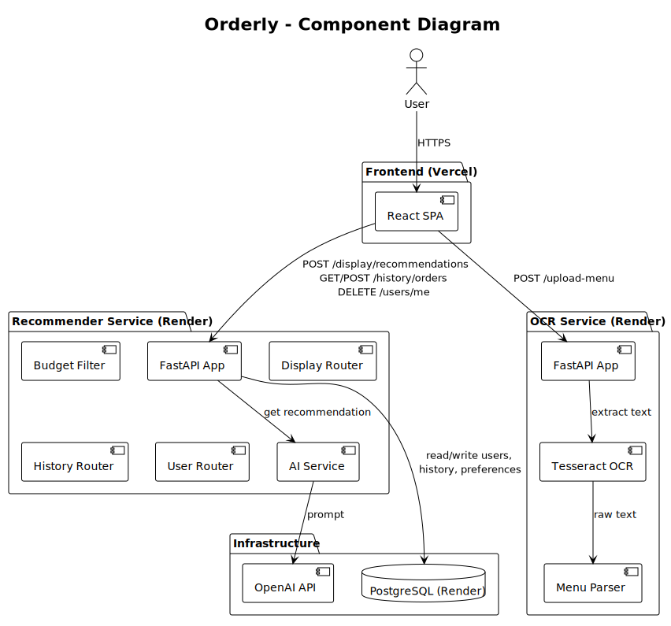
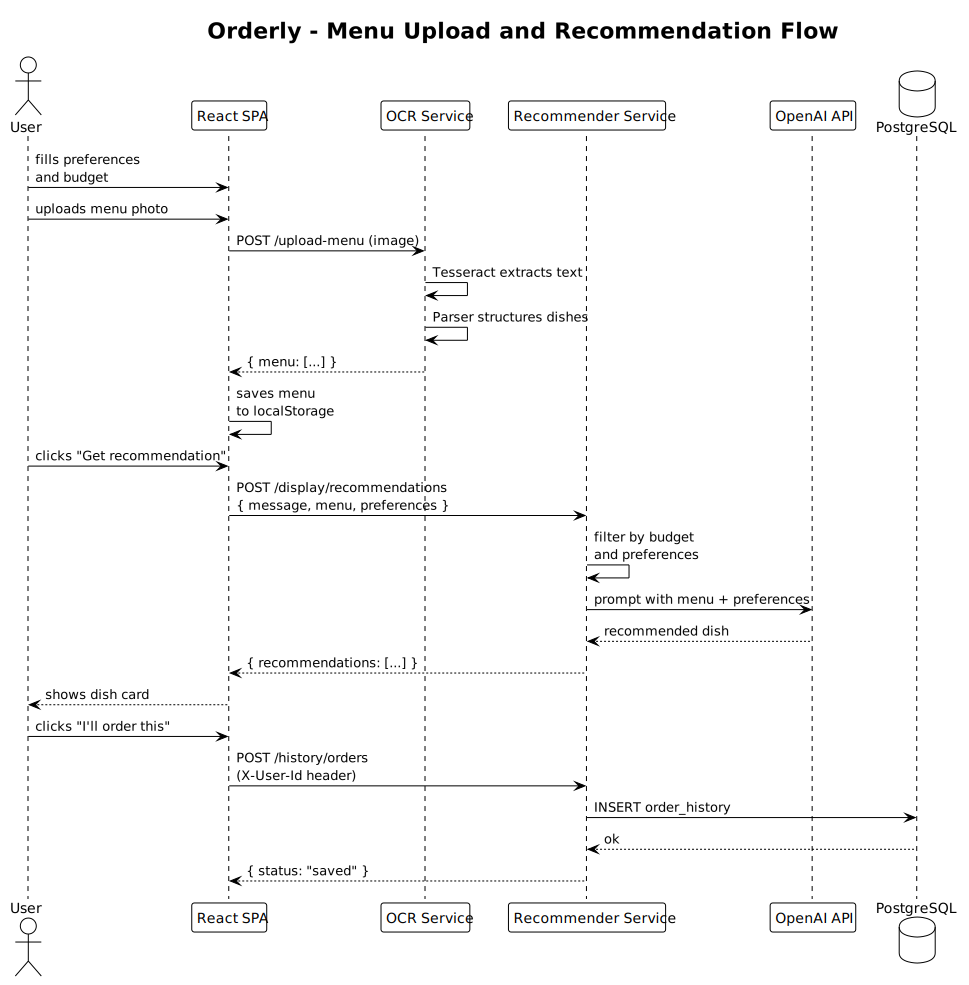
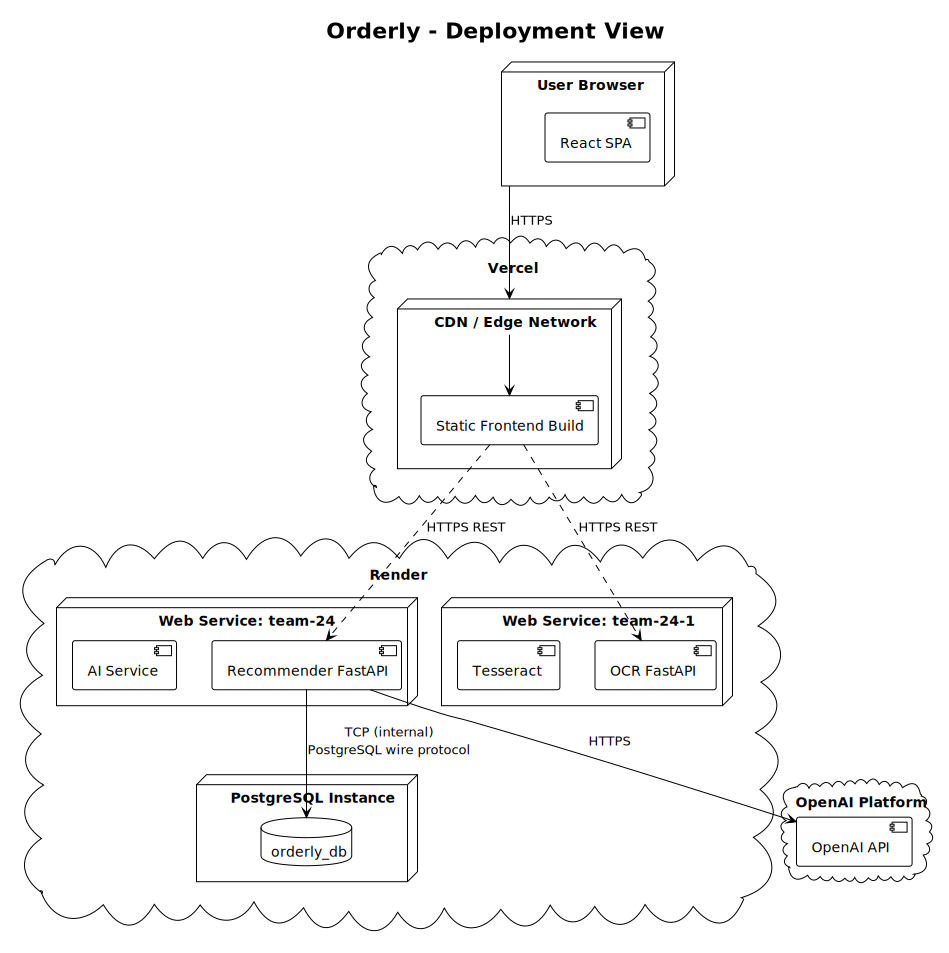

# Architecture Documentation – Orderly

Orderly is a food recommendation web app. This document covers three architectural views: static (component structure), dynamic (key request flow), and deployment (runtime topology). Together they explain what the system is made of, how important flows work, and where everything runs.

---

## Table of Contents

- [Static View – Component Diagram](#static-view--component-diagram)
- [Dynamic View – Sequence Diagram](#dynamic-view--sequence-diagram)
- [Deployment View – Deployment Diagram](#deployment-view--deployment-diagram)
- [Architecture Decisions (ADRs)](#architecture-decisions-adrs)

---

## Static View – Component Diagram

[PlantUML source](static-view/component-diagram.puml)

### What the diagram shows

The system has three independently deployed units: the React SPA (Vercel), the Recommender Service (Render), and the OCR Service (Render). The user interacts only with the frontend. The frontend communicates with both backend services over HTTPS REST. The two backend services never communicate directly with each other — the frontend acts as the orchestrator, passing the structured menu from the OCR service to the Recommender service.

The Recommender service owns all stateful logic: it reads and writes to PostgreSQL (users, preferences, order history, dislikes) and calls the OpenAI API to generate dish recommendations. The OCR service is stateless: it receives an image, runs Tesseract, parses the result, and returns structured menu data.

### Coupling and cohesion

The services are loosely coupled: each can be deployed, restarted, or scaled independently. The OCR service has no knowledge of users or recommendations; the Recommender service has no knowledge of image processing. This separation makes each service individually cohesive.

Within the Recommender service, cohesion is moderate. The AI service, budget filter, display router, history router, and user router are separate modules with clear responsibilities. The main coupling risk is that all modules share the same FastAPI process and the same PostgreSQL connection pool.

### Maintainability implications

The split into two backend services adds operational overhead (two Render deployments, two Dockerfiles, two requirements files) but reduces the risk of a change in OCR logic breaking recommendation logic. Adding a new backend feature (e.g., user profile) only requires touching the Recommender service.

The frontend acting as orchestrator keeps backend-to-backend coupling at zero, but means the frontend must handle partial failures (e.g., OCR succeeds but recommendations fail) explicitly.

### Quality requirements supported

- **Reliability:** service isolation means an OCR outage does not take down the recommender.
- **Maintainability:** clear module boundaries make it straightforward to swap the OCR engine or the AI provider independently.
- **Security:** PostgreSQL credentials are never exposed to the frontend; the database is on Render's internal network, reachable only from the Recommender service.

---

## Dynamic View – Sequence Diagram

[PlantUML source](dynamic-view/sequence-diagram.puml)

### What the scenario represents

The diagram shows the core end-to-end flow: a user uploads a menu photo, receives a personalized dish recommendation, and saves it to their order history.

### Why this scenario is important

This is the primary value-delivering flow of the product. Every Sprint has contributed to making this flow work reliably. Understanding the sequence helps reason about where latency occurs (Tesseract OCR and OpenAI calls are the two slow steps), where failures can happen (network errors between frontend and each backend), and what state is created (order history row in PostgreSQL).

### Architecture decisions and integration boundaries this illustrates

- The frontend stores the parsed menu in `localStorage` between the OCR call and the recommendation call. This is an explicit architectural decision: the two backend services do not share state directly.
- The `X-User-Id` header is currently used as a temporary auth placeholder. When JWT is implemented, this header will be replaced by a Bearer token — the rest of the flow stays the same.
- The OpenAI call is synchronous and blocking. If OpenAI is slow or unavailable, the recommendation endpoint returns 503. This is a known latency and reliability risk documented in [ADR-003](adr/ADR-003-openai-integration.md).

---

## Deployment View – Deployment Diagram

[PlantUML source](deployment-view/deployment-diagram.puml)

### What the diagram shows

The frontend is built by Vercel's CI on every push to `main` and served from Vercel's CDN edge network. Both backend services run as Docker containers on Render's free tier. The PostgreSQL instance runs on Render in the same region as the Recommender service, connected via Render's internal network (no public exposure). The Recommender service calls OpenAI's public API over HTTPS.

### Why this deployment model was chosen

Vercel was chosen for the frontend because it provides zero-configuration CI/CD for React apps and a global CDN with no cost on the free tier. Render was chosen for the backends because it supports Docker deployments and managed PostgreSQL on the free tier, which avoids the need to manage infrastructure manually for a course project.

Separating the OCR service into its own Render web service was necessary because Tesseract requires system-level packages (`tesseract-ocr`) that would significantly increase the image size of the Recommender service and complicate its Dockerfile.

### How the deployment supports or constrains the product

**Supports:** zero-infrastructure-management, automatic deploys on push to `main`, managed database backups on Render.

**Constrains:** Render free-tier services spin down after 15 minutes of inactivity, causing 30–60 second cold starts on the first request. This is a known UX issue. Both backend services are affected, meaning the first upload and the first recommendation after inactivity will both be slow. This is documented in the root README.

### Operational considerations

- `DATABASE_URL` must be set as an environment variable on the Recommender service in Render. It must never be committed to the repository.
- `OPENAI_API_KEY` must be set as an environment variable on the Recommender service. It must never be committed to the repository.
- Alembic migrations (`alembic upgrade head`) must be run manually from `src/db/` after any schema change, using the External Database URL from Render with `DATABASE_URL` set in the shell.
- `ALLOWED_ORIGINS` must include the Vercel frontend URL on both backend services to avoid CORS errors.

---

## Architecture Decisions (ADRs)

| ID | Title | Status |
|---|---|---|
| [ADR-001](adr/ADR-001-split-backend-services.md) | Split OCR and Recommender into separate services | Accepted |
| [ADR-002](adr/ADR-002-postgresql-sqlalchemy.md) | Use PostgreSQL with SQLAlchemy and Alembic | Accepted |
| [ADR-003](adr/ADR-003-openai-integration.md) | Use OpenAI API for dish recommendations | Accepted |

These decisions collectively explain the current service topology, the persistence strategy, and the AI integration approach. Each ADR identifies which quality requirements it addresses.
