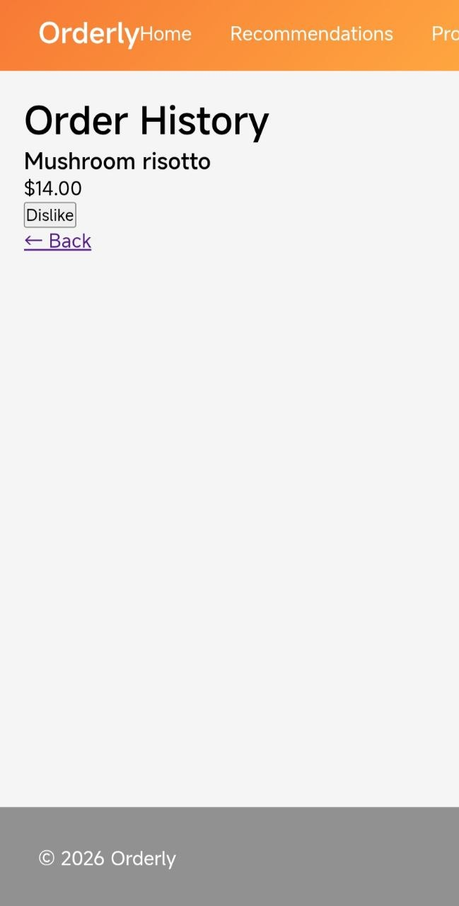

# US-015-4: E2E Verification

## Manual Test

1. Get a dish recommendation.
2. Click **I'll order it**.
3. Open **History**.
4. Click **Dislike**.
5. Request another recommendation.
6. Verify the disliked dish is not recommended again.

**Result:** Passed

---

## API

### POST /history/orders/{dish_id}/dislike

Marks a dish as disliked.

```bash
curl -X POST "http://localhost:8000/history/orders/1/dislike" \
  -H "X-User-Id: 1"
```

### GET /history/dislikes

Returns the user's disliked dish IDs.

```bash
curl -X GET "http://localhost:8000/history/dislikes" \
  -H "X-User-Id: 1"
```

---

## Screenshot

