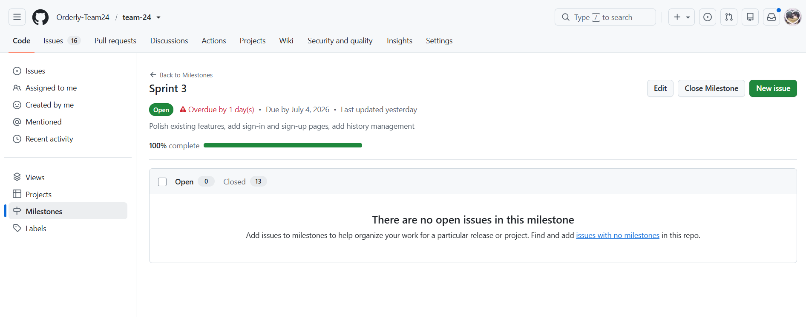
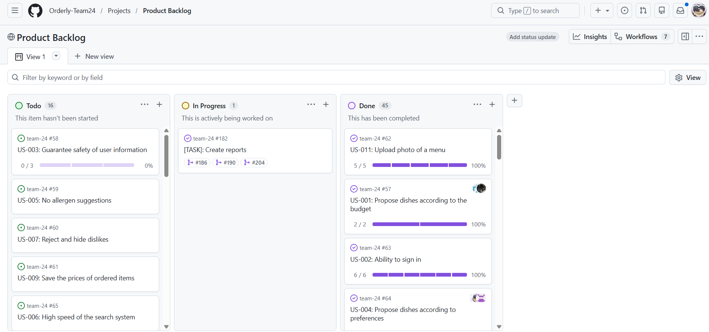
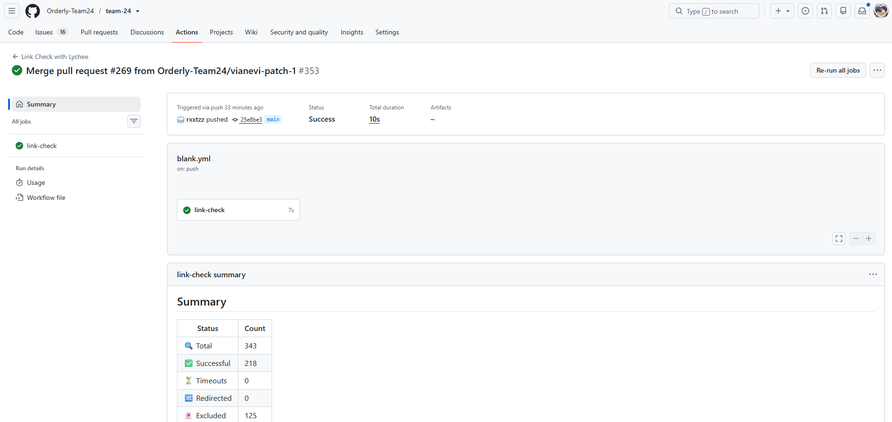
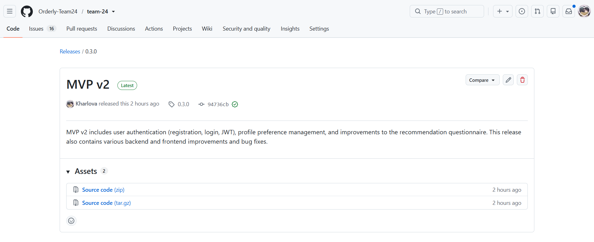
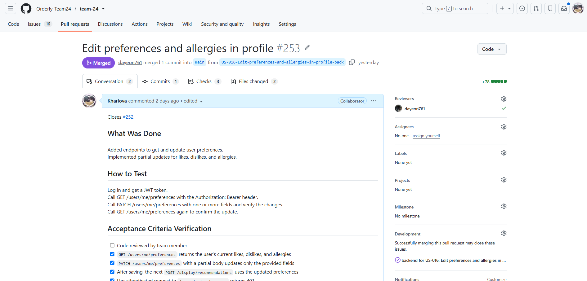
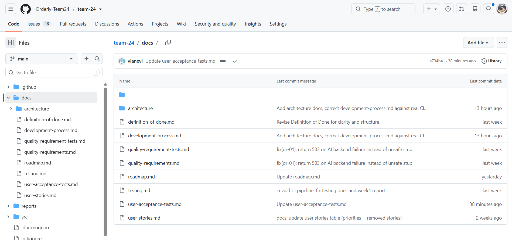

# Week 5 Report – Orderly

## Project information
- **Name:** Orderly – Food Recommendation App
- **Short description:** A web app that helps users choose dishes from restaurant menus based on their preferences and budget.
- **License:** [MIT](../../LICENSE) 

## Product Backlog
- [Product Backlog board/view](https://github.com/orgs/Orderly-Team24/projects/2)
- [Current Sprint Backlog board/view](https://github.com/orgs/Orderly-Team24/projects/3)
- [Current Sprint milestone](https://github.com/Orderly-Team24/team-24/milestone/3)

### Sprint Details
- **Sprint Goal:** Polish existing features, add sign-in and sign-up pages
- **Sprint Dates:** June 29 2026 – July 05 2026
- **Scope Summary:** Authentication (registration, login, JWT), user preferences fixes and frontend polish.
- **Total Sprint Size:** 20 Story Points

## Delivery Summary
- **Delivered Product Changes:** Added user registration and login with JWT authentication, connected to the database, and replaced the questionnaire with free-text input fields for allergies, dislikes, likes, and dietary restrictions (halal, vegan, kosher, etc).
- **Access/Run instructions:** [README.md](../../README.md)
- **Deployed Product (runnable artifact):** [product](https://team-24-navy.vercel.app/register)

## Customer Feedback & Response
| Feedback Point | Resulting PBI / Issue |
| :--- | :--- |
| No order history yet | [#149](https://github.com/Orderly-Team24/team-24/issues/149) — US-015: Managing history of orders |

### Feedback Not Addressed
The customer could not test the application duringt the meeting because the deployment was unavailable.

## Documentation
- **Roadmap:** [docs/roadmap.md](../../docs/roadmap.md)
- **Definition of Done:** [docs/definition-of-done.md](../../docs/definition-of-done.md)
- **Testing Strategy:** [docs/testing.md](../../docs/testing.md)
- **Quality Requirements:** [docs/quality-requirements.md](../../docs/quality-requirements.md)
- **Quality Requirement Tests:** [docs/quality-requirement-tests.md](../../docs/quality-requirement-tests.md)
- **User Acceptance Tests (UAT):** [docs/user-acceptance-tests.md](../../docs/user-acceptance-tests.md)
- **Development process:** [docs/development-process.md](../../docs/development-process.md)
- **README of Architecture** [docs/architecture/README.md](../../docs/architecture/README.md)
- **Hosted Documentation Site:** [Orderly Docs](../../docs)

### Test Links
- **Unit Tests:** test_budget_filter.py, test_history_router.py, test_parser.py, test_preferences.py, test_upload.py, test_parser.py
- **Integration Tests:** test_budget_filter.py, test_history_router.py, test_ai_service.py, test_response_time.py, test_upload.py
- **Automated Quality Requirement Tests:** quality-requirement-tests.md, test_response_time.py

## Architecture Views
- **Static View:** [Static Architecture View](../../docs/architecture/static-view/component-diagram.svg)
- **Dynamic View:** [Dynamic Architecture View](../../docs/architecture/dynamic-view/sequence-diagram.svg)
- **Deployment View:** [Deployment Architecture View](../../docs/architecture/deployment-view/deployment-diagram.svg)

### Architecture Summary
Orderly uses a three-tier architecture with a React frontend, two independent FastAPI backend services (Recommender and OCR), and a PostgreSQL database. The frontend coordinates communication between services, while the Recommender service manages business logic, user data, and AI-powered recommendations. This modular design improves maintainability, scalability, and separation of concerns.

### Quality Requirements & Architecture Alignment
Quality requirements are directly supported by the architecture decisions. Separating the OCR and Recommender services improves fault tolerance (QR-01). Using FastAPI with a lightweight in-process recommendation flow helps achieve response time targets (QR-02). SQLAlchemy models, Pydantic validation, and authenticated API endpoints enforce input validation and security (QR-03).

### Architecture Decision Records (ADR)
- **ADR-001:** [Split backend services](../../docs/architecture/adr/ADR-001-split-backend-services.md)
- **ADR-002:** [Postgresql sqlalchemy](../../docs/architecture/adr/ADR-002-postgresql-sqlalchemy.md)
- **ADR-003:** [Openai integration](../../docs/architecture/adr/ADR-003-openai-integration.md)

### Test Links

**Unit Tests:** test_budget_filter.py, test_history_router.py, test_parser.py, test_preferences.py, test_user_route.py, test_users.py

**Integration Tests:** test_ai_service.py, test_response_time.py, test_upload.py

**Automated Quality Requirement Tests:** test_response_time.py, test_ai_service.py

## CI / CD & Branch Protection
- **CI Pipeline Definition:** [CI pipeline definition](../../.github/workflows/blank.yml)
- **Latest Protected-Branch CI Run:** [CI Run](https://github.com/Orderly-Team24/team-24/actions/runs/28751874890)
- **Branch Protection Rules Evidence:** [Rules](https://github.com/Orderly-Team24/team-24/settings/branches)

## Forward Governance
**How Assignment 4 artifacts will govern future work:**
All future work will be governed by the Assignment 4 artifacts:
- **DoD** — all tasks must meet Definition of Done before closing.
- **CI/CD** — must pass on every PR and push to `main`.
- **Testing** — unit + integration tests required, coverage ≥ 30% for critical modules.
- **Branch Protection** — PR approvals + CI required for merging.

## Release & Changelog
- **SemVer Release:** [SemVer](https://github.com/Orderly-Team24/team-24/releases/tag/0.3.0)
- **CHANGELOG.md:** [CHANGELOG.md](../../CHANGELOG.md)

## Presentation & Media
- **Demo Video:** [video](https://drive.google.com/file/d/1n7aTGUpr3jBHVEm6FIkM_EXHW4KH5D3y/view?usp=drivesdk)
- **Customer Review Transcript:** [customer review transcript](customer-review-transcript.md)

## UAT Results Summary
**UAT-04 (Sign In With Existing Account)** - passed (US-002 – Ability to sign in)
**UAT-05 (Delete Account)** - passed (US-017 – Delete account)
**UAT-06 (End Session)** - passed (US-014 – Button "End session")
**UAT-07 (Specify Today's Meal Intent Alongside Budget)** - passed (US-018 – Specify today's meal intent alongside budget)

## Sprint Reports & Retrospectives
- **Sprint review transcript:** [sprint review transcript](sprint-review-transcript.md)
- **Customer Review Summary:** [customer review summary](customer-review-summary.md)
- **Sprint Reflection:** [Week 5 Reflection](reflection.md)
- **Retrospective:** [Week 5 Retrospective](retrospective.md)
- **LLM Report:** [LLM Report](llm-report.md)

## Current Status & Next Steps
- **Current Product Status:** Questionnaire, budget filtering, default menu recommendations, and UI flow are working. User authentication and profile preferences have been implemented. Some deployment and backend integration issues remain.
- **Next Steps:** Implement order history functionality and polishing all features.
  
## Contribution Traceability

| Team Member | Issues | PRs/MRs | Review Activity | Testing | Quality/Automation | Documentation |
| :--- | :--- | :--- | :--- | :--- | :--- | :--- |
| Daria Gorshkova (dayeon761) | [#221](https://github.com/Orderly-Team24/team-24/issues/221) | [#261](https://github.com/Orderly-Team24/team-24/pull/261), [#259](https://github.com/Orderly-Team24/team-24/pull/259), [#256](https://github.com/Orderly-Team24/team-24/pull/256), [#255](https://github.com/Orderly-Team24/team-24/pull/255), [#246](https://github.com/Orderly-Team24/team-24/pull/246), [#236](https://github.com/Orderly-Team24/team-24/pull/236) | [#253](https://github.com/Orderly-Team24/team-24/pull/253), [#249](https://github.com/Orderly-Team24/team-24/pull/249), [#245](https://github.com/Orderly-Team24/team-24/pull/245), [#244](https://github.com/Orderly-Team24/team-24/pull/244), [#243](https://github.com/Orderly-Team24/team-24/pull/243), [#242](https://github.com/Orderly-Team24/team-24/pull/242), [#235](https://github.com/Orderly-Team24/team-24/pull/235), [#234](https://github.com/Orderly-Team24/team-24/pull/234) | - | - | - |
| Viktoriia Iakovleva (rxxtzz) | [#222](https://github.com/Orderly-Team24/team-24/issues/222), [#221](https://github.com/Orderly-Team24/team-24/issues/221), [#216](https://github.com/Orderly-Team24/team-24/issues/216), [#148](https://github.com/Orderly-Team24/team-24/issues/148), [#79](https://github.com/Orderly-Team24/team-24/issues/79), [#78](https://github.com/Orderly-Team24/team-24/issues/78), [#76](https://github.com/Orderly-Team24/team-24/issues/76), [#74](https://github.com/Orderly-Team24/team-24/issues/74) | [#266](https://github.com/Orderly-Team24/team-24/pull/266), [#265](https://github.com/Orderly-Team24/team-24/pull/265), [#264](https://github.com/Orderly-Team24/team-24/pull/264), [#262](https://github.com/Orderly-Team24/team-24/pull/262), [#260](https://github.com/Orderly-Team24/team-24/pull/260), [#254](https://github.com/Orderly-Team24/team-24/pull/254), [#243](https://github.com/Orderly-Team24/team-24/pull/243), [#242](https://github.com/Orderly-Team24/team-24/pull/242), [#235](https://github.com/Orderly-Team24/team-24/pull/235), [#234](https://github.com/Orderly-Team24/team-24/pull/234), [#233](https://github.com/Orderly-Team24/team-24/pull/233) | [#263](https://github.com/Orderly-Team24/team-24/pull/263), [#261](https://github.com/Orderly-Team24/team-24/pull/261), [#257](https://github.com/Orderly-Team24/team-24/pull/257), [#256](https://github.com/Orderly-Team24/team-24/pull/256), [#251](https://github.com/Orderly-Team24/team-24/pull/251), [#248](https://github.com/Orderly-Team24/team-24/pull/248), [#241](https://github.com/Orderly-Team24/team-24/pull/241), [#240](https://github.com/Orderly-Team24/team-24/pull/240), [#239](https://github.com/Orderly-Team24/team-24/pull/239) | - | - | [reports/week5/sprint-review-summary.md](../../reports/week5/sprint-review-summary.md), [reports/week5/sprint-review-transcript.md](../../reports/week5/sprint-review-transcript.md), [reports/week5/reflection.md](../../reports/week5/reflection.md), [reports/week5/retrospective.md](../../reports/week5/retrospective.md), [reports/week5/llm-report.md](../../reports/week5/llm-report.md), [docs/roadmap.md](../../docs/roadmap.md) |
| Polina Kharlova (Kharlova) | [#216](https://github.com/Orderly-Team24/team-24/issues/216), [#78](https://github.com/Orderly-Team24/team-24/issues/78), [#77](https://github.com/Orderly-Team24/team-24/issues/77) | [#253](https://github.com/Orderly-Team24/team-24/pull/253), [#251](https://github.com/Orderly-Team24/team-24/pull/251), [#249](https://github.com/Orderly-Team24/team-24/pull/249), [#245](https://github.com/Orderly-Team24/team-24/pull/245), [#244](https://github.com/Orderly-Team24/team-24/pull/244) | [#259](https://github.com/Orderly-Team24/team-24/pull/259), [#258](https://github.com/Orderly-Team24/team-24/pull/258), [#246](https://github.com/Orderly-Team24/team-24/pull/246) | - | - | [reports/week4/README.md](../../reports/week4/README.md) |
| Vilena Zulkarnaeva (vianevi) | [#222](https://github.com/Orderly-Team24/team-24/issues/222), [#221](https://github.com/Orderly-Team24/team-24/issues/221), [#216](https://github.com/Orderly-Team24/team-24/issues/216), [#148](https://github.com/Orderly-Team24/team-24/issues/148), [#79](https://github.com/Orderly-Team24/team-24/issues/79), [#78](https://github.com/Orderly-Team24/team-24/issues/78), [#76](https://github.com/Orderly-Team24/team-24/issues/76), [#74](https://github.com/Orderly-Team24/team-24/issues/74) | [#263](https://github.com/Orderly-Team24/team-24/pull/263), [#257](https://github.com/Orderly-Team24/team-24/pull/257), [#241](https://github.com/Orderly-Team24/team-24/pull/241), [#240](https://github.com/Orderly-Team24/team-24/pull/240) | [#266](https://github.com/Orderly-Team24/team-24/pull/266), [#265](https://github.com/Orderly-Team24/team-24/pull/265), [#264](https://github.com/Orderly-Team24/team-24/pull/264), [#262](https://github.com/Orderly-Team24/team-24/pull/262), [#260](https://github.com/Orderly-Team24/team-24/pull/260), [#259](https://github.com/Orderly-Team24/team-24/pull/259), [#255](https://github.com/Orderly-Team24/team-24/pull/255), [#254](https://github.com/Orderly-Team24/team-24/pull/254), [#233](https://github.com/Orderly-Team24/team-24/pull/233) | - | - | [reports/week5/sprint-review-summary.md](../../reports/week5/sprint-review-summary.md), [reports/week5/sprint-review-transcript.md](../../reports/week5/sprint-review-transcript.md), [reports/week5/reflection.md](../../reports/week5/reflection.md), [reports/week5/retrospective.md](../../reports/week5/retrospective.md), [reports/week5/llm-report.md](../../reports/week5/llm-report.md), [docs/roadmap.md](../../docs/roadmap.md) |
| Omar Nader (Ramy678) | [#218](https://github.com/Orderly-Team24/team-24/issues/218), [#217](https://github.com/Orderly-Team24/team-24/issues/217) | [#248](https://github.com/Orderly-Team24/team-24/pull/248), [#247](https://github.com/Orderly-Team24/team-24/pull/247), [#239](https://github.com/Orderly-Team24/team-24/pull/239) | - | - | [docs/quality-requirements.md](../../docs/quality-requirements.md) | - |
| Adelina Khafizova (adelinamikki) | [#219](https://github.com/Orderly-Team24/team-24/issues/219) | [#258](https://github.com/Orderly-Team24/team-24/pull/258) | - | [docs/user-acceptance-tests.md](../../docs/user-acceptance-tests.md) | - | - |

## Visual Evidence (Screenshots
### Sprint Milestone

### Board or project workflow view

### Latest Protected-Branch CI Run

### SemVer Release

### Example Reviewed Issue-linked PR/MR

### Hosted docs site

