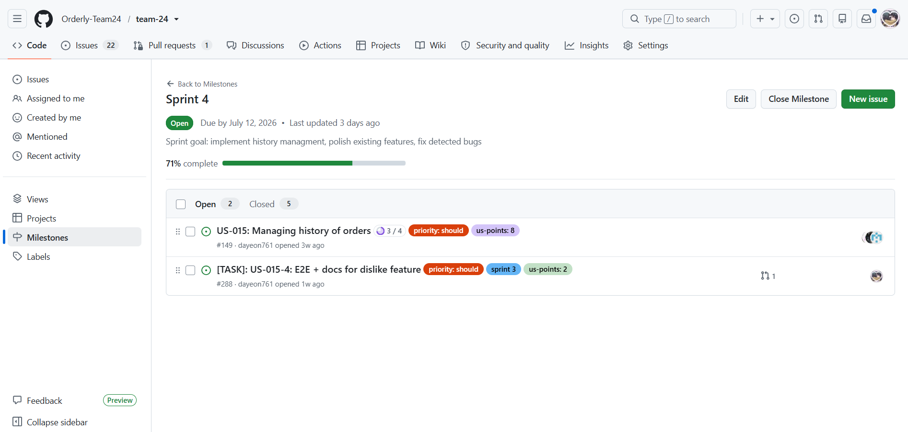
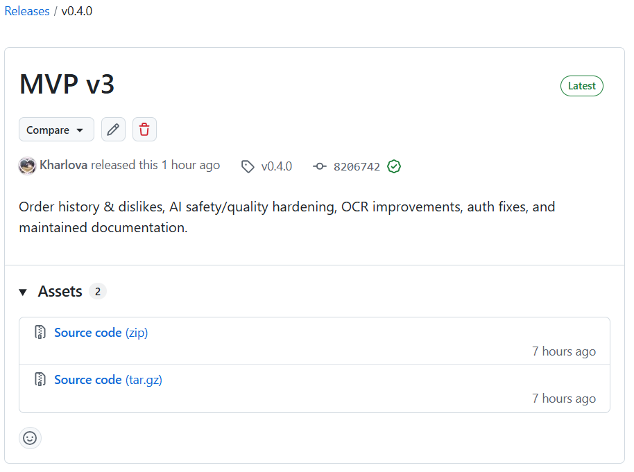
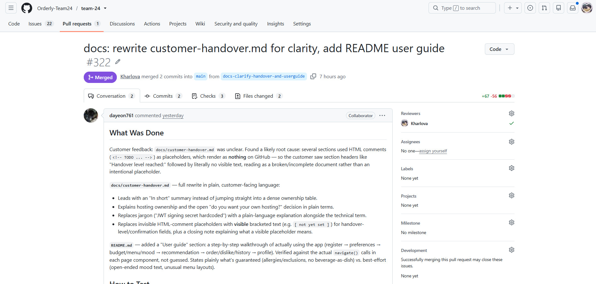

# Week 6 Report – Orderly

## Project information
- **Name:** Orderly – Food Recommendation App
- **Short description:** A web app that helps users choose dishes from restaurant menus based on their preferences and budget.
- **License:** [MIT](../../LICENSE)

## Product Backlog
- [Product Backlog board/view](https://github.com/orgs/Orderly-Team24/projects/2)
- [Current Sprint Backlog board/view](https://github.com/orgs/Orderly-Team24/projects/3)
- [Sprint 4 milestone](https://github.com/Orderly-Team24/team-24/milestone/4)

### Sprint Details
- **Sprint Goal:** Implement order history management (view history, dislike a dish), polish AI recommendation quality, and fix bugs found during customer UAT.
- **Sprint Dates:** July 06 2026 – July 12 2026
- **Scope Summary:** Order history + dislike feature (US-015), AI recommendation safety hardening (allergen/exclusion guarantees, meal-type recognition, beverage exclusion), authentication and session bug fixes.
- **Total Sprint Size:** 8 Story Points

## Delivery Summary
**Delivered Product Changes:**
Order history + dislikes (US-015), AI safety hardening, meal-type recognition, no beverage as dish, no-repeat recommendations, OCR improvements, auth and session bug fixes, removed unused cuisine preference, added maintained docs.
- **Access/Run instructions:** [README.md](../../README.md)
- **Deployed Product (runnable artifact):** [product](https://team-24-navy.vercel.app/)

## Customer Feedback & Response
| Feedback Point | Resulting PBI / Issue |
| :--- | :--- |
| Meal type filtering (breakfast/dinner/drinks) is unstable | [#328](https://github.com/Orderly-Team24/team-24/issues/328) |
| Remove extra "Recommendations" button from UI | [#329](https://github.com/Orderly-Team24/team-24/issues/329) |
| Add user guide or clearer instructions for independent use | [#330](https://github.com/Orderly-Team24/team-24/issues/330) |
| Implement text field for dietary preferences | [#331](https://github.com/Orderly-Team24/team-24/issues/331) |

### Feedback Not Addressed
All feedback points from the customer meeting have been converted into PBIs/issues and scheduled for Week 7.

## Documentation
- **Contributing:** [CONTRIBUTING.md](../../CONTRIBUTING.md)
- **AGENTS.md:** [AGENTS.md](../../AGENTS.md)
- **Customer handover:** [docs/customer-handover.md](../../docs/customer-handover.md)
- **Roadmap:** [docs/roadmap.md](../../docs/roadmap.md)
- **Definition of Done:** [docs/definition-of-done.md](../../docs/definition-of-done.md)
- **Testing Strategy:** [docs/testing.md](../../docs/testing.md)
- **Quality Requirements:** [docs/quality-requirements.md](../../docs/quality-requirements.md)
- **Quality Requirement Tests:** [docs/quality-requirement-tests.md](../../docs/quality-requirement-tests.md)
- **User Acceptance Tests (UAT):** [docs/user-acceptance-tests.md](../../docs/user-acceptance-tests.md)
- **Development process:** [docs/development-process.md](../../docs/development-process.md)
- **README of Architecture** [docs/architecture/README.md](../../docs/architecture/README.md)
- **Hosted Documentation Site:** [Orderly Docs](https://orderly-team24.github.io/team-24/)

### Doc Review Results
Customer found README and CONTRIBUTING clear and accepted customer-handover.md in its current state, but requested a user guide for independent use and found the handover terminology confusing.

### Transition-Readiness Summary
- Customer accepted the current handover state and approved the product as "acceptable". Missing user guide will be added Week 7; handover terminology needs clarification.
- Week 7: finalize AI/OCR fixes, add user guide, and prepare complete handover package.

### Test Links
- **Unit Tests (backend):** `test_ai_service.py`, `test_auth.py` (new), `test_no_repeat_session.py` (new), `test_preferences.py`, `test_dislike_filter.py`, `test_history_router.py`, `test_budget_filter.py`, `test_user_route.py`, `test_users.py`
- **Unit Tests (OCR service):** `test_parser.py`, `test_ocr_layout.py` (new), `test_upload.py`
- **Automated Quality Requirement Tests:** `test_response_time.py`

## Architecture Views
- **Static View:** [Static Architecture View](../../docs/architecture/static-view/component-diagram.svg)
- **Dynamic View:** [Dynamic Architecture View](../../docs/architecture/dynamic-view/sequence-diagram.svg)
- **Deployment View:** [Deployment Architecture View](../../docs/architecture/deployment-view/deployment-diagram.svg)

### Architecture Decision Records (ADR)
- **ADR-001:** [Split backend services](../../docs/architecture/adr/ADR-001-split-backend-services.md)
- **ADR-002:** [Postgresql sqlalchemy](../../docs/architecture/adr/ADR-002-postgresql-sqlalchemy.md)
- **ADR-003:** [Openai integration](../../docs/architecture/adr/ADR-003-openai-integration.md)

## CI / CD & Branch Protection
- **CI Pipeline Definition:** [backend-ci.yml](../../.github/workflows/backend-ci.yml), [blank.yml (link check)](../../.github/workflows/blank.yml)
- **Branch Protection Rules Evidence:** [Rules](https://github.com/Orderly-Team24/team-24/settings/branches)

## Release & Changelog
- **CHANGELOG.md:** [CHANGELOG.md](../../CHANGELOG.md) 
- **SemVer Release:** [SemVer](https://github.com/Orderly-Team24/team-24/releases/tag/v0.4.0)

## Presentation & Media
- 

## UAT Results Summary
- UAT-08 (View Order History and Dislike a Dish) – passed (US-015 – Managing history of orders)
- UAT-09 (AI Never Recommends an Excluded or Allergen Food) – passed (US-005 – No allergen suggestions)
- UAT-10 (AI Recognizes Meal Type and Never Recommends a Drink as the Dish) – passed (US-018 – Specify today's meal intent alongside budget)

## Sprint Reports & Retrospectives
- **Sprint review transcript / notes:** [sprint-review-transcript.md](sprint-review-transcript.md)
- **Customer Review Summary:** [sprint-review-summary.md](sprint-review-summary.md)
- **Sprint Reflection:** [reflection.md](reflection.md)
- **Retrospective:** [retrospective.md](retrospective.md)
- **LLM Report:** [llm-report.md](llm-report.md)

## Current Status & Next Steps
- **Current Product Status:** Order history and dislikes are implemented end-to-end; AI recommendation safety (allergens/exclusions) and quality (meal type, no beverage-as-dish, no-repeat) have been substantially hardened this sprint; a cluster of authentication/session bugs found during UAT has been fixed.
- **Next Steps (expected Week 7 scope, pending Week 6 customer feedback):** Fix unstable meal type filtering; remove UI button; add user guide for independent use; implement text field for dietary preferences (vegan, halal, etc.); final polish of AI service and OCR (support more menu types).
## Contribution Traceability

| Team Member | Issues | PRs/MRs | Review Activity | Documentation |
| :--- | :--- | :--- | :--- | :--- |
| Daria Gorshkova (dayeon761) | [#285](https://github.com/Orderly-Team24/team-24/issues/285) | [#322](https://github.com/Orderly-Team24/team-24/pull/322), [#319](https://github.com/Orderly-Team24/team-24/pull/319), [#318](https://github.com/Orderly-Team24/team-24/pull/318), [#317](https://github.com/Orderly-Team24/team-24/pull/317), [#316](https://github.com/Orderly-Team24/team-24/pull/316), [#314](https://github.com/Orderly-Team24/team-24/pull/314), [#313](https://github.com/Orderly-Team24/team-24/pull/313), [#312](https://github.com/Orderly-Team24/team-24/pull/312), [#308](https://github.com/Orderly-Team24/team-24/pull/308), [#307](https://github.com/Orderly-Team24/team-24/pull/307), [#306](https://github.com/Orderly-Team24/team-24/pull/306), [#305](https://github.com/Orderly-Team24/team-24/pull/305), [#302](https://github.com/Orderly-Team24/team-24/pull/302), [#300](https://github.com/Orderly-Team24/team-24/pull/300), [#299](https://github.com/Orderly-Team24/team-24/pull/299), [#297](https://github.com/Orderly-Team24/team-24/pull/297), [#294](https://github.com/Orderly-Team24/team-24/pull/294) | [#315](https://github.com/Orderly-Team24/team-24/pull/315), [#310](https://github.com/Orderly-Team24/team-24/pull/310), [#301](https://github.com/Orderly-Team24/team-24/pull/301), [#293](https://github.com/Orderly-Team24/team-24/pull/293), [#292](https://github.com/Orderly-Team24/team-24/pull/292), [#291](https://github.com/Orderly-Team24/team-24/pull/291), [#276](https://github.com/Orderly-Team24/team-24/pull/276) | [README.md](../../README.md), [CHANGELOG.md](../../CHANGELOG.md), [docs/user-acceptance-tests.md](../../docs/user-acceptance-tests.md) |
| Viktoriia Iakovleva (rxxtzz) | [#282](https://github.com/Orderly-Team24/team-24/issues/282) | [#320](https://github.com/Orderly-Team24/team-24/pull/320), [#292](https://github.com/Orderly-Team24/team-24/pull/292) | [#323](https://github.com/Orderly-Team24/team-24/pull/323), [#321](https://github.com/Orderly-Team24/team-24/pull/321), [#319](https://github.com/Orderly-Team24/team-24/pull/319), [#318](https://github.com/Orderly-Team24/team-24/pull/318), [#314](https://github.com/Orderly-Team24/team-24/pull/314), [#313](https://github.com/Orderly-Team24/team-24/pull/313), [#312](https://github.com/Orderly-Team24/team-24/pull/312), [#307](https://github.com/Orderly-Team24/team-24/pull/307), [#306](https://github.com/Orderly-Team24/team-24/pull/306) | [docs/roadmap.md](../../docs/roadmap.md) |
| Polina Kharlova (Kharlova) | [#288](https://github.com/Orderly-Team24/team-24/issues/288), [#311](https://github.com/Orderly-Team24/team-24/issues/311), [#295](https://github.com/Orderly-Team24/team-24/issues/295) | [#310](https://github.com/Orderly-Team24/team-24/pull/310), [#309](https://github.com/Orderly-Team24/team-24/pull/309), [#326](https://github.com/Orderly-Team24/team-24/pull/326) | [#327](https://github.com/Orderly-Team24/team-24/pull/327), [#325](https://github.com/Orderly-Team24/team-24/pull/325), [#322](https://github.com/Orderly-Team24/team-24/pull/322), [#308](https://github.com/Orderly-Team24/team-24/pull/308), [#304](https://github.com/Orderly-Team24/team-24/pull/304), [#302](https://github.com/Orderly-Team24/team-24/pull/302), [#300](https://github.com/Orderly-Team24/team-24/pull/300), [#299](https://github.com/Orderly-Team24/team-24/pull/299), [#297](https://github.com/Orderly-Team24/team-24/pull/297) | [reports/week6/README.md](README.md) | 
| Vilena Zulkarnaeva (vianevi) | [#287](https://github.com/Orderly-Team24/team-24/issues/287) | [#327](https://github.com/Orderly-Team24/team-24/pull/327), [#323](https://github.com/Orderly-Team24/team-24/pull/323), [#321](https://github.com/Orderly-Team24/team-24/pull/321), [#301](https://github.com/Orderly-Team24/team-24/pull/301), [#293](https://github.com/Orderly-Team24/team-24/pull/293), [#276](https://github.com/Orderly-Team24/team-24/pull/276) | [#320](https://github.com/Orderly-Team24/team-24/pull/320), [#305](https://github.com/Orderly-Team24/team-24/pull/305), [#294](https://github.com/Orderly-Team24/team-24/pull/294) | [reports/week6/sprint-review-summary.md](sprint-review-summary.md), [reports/week6/sprint-review-transcript.md](sprint-review-transcript.md), [reports/week6/reflection.md](reflection.md), [reports/week6/retrospective.md](retrospective.md) |
| Omar Nader (Ramy678) | [#286](https://github.com/Orderly-Team24/team-24/issues/286) | [#325](https://github.com/Orderly-Team24/team-24/pull/325) | - | [reports/week6/llm-report.md](llm-report.md) |
| Adelina Khafizova (adelinamikki) | [#283](https://github.com/Orderly-Team24/team-24/issues/283) | [#315](https://github.com/Orderly-Team24/team-24/pull/315), [#291](https://github.com/Orderly-Team24/team-24/pull/291) | [#317](https://github.com/Orderly-Team24/team-24/pull/317), [#316](https://github.com/Orderly-Team24/team-24/pull/316) | [CONTRIBUTING.md](../../CONTRIBUTING.md), [AGENTS.md](../../AGENTS.md), [docs/customer-handover.md](../../docs/customer-handover.md) |

## Visual Evidence
### Sprint Milestone

### SemVer Release

### Example Reviewed Issue-linked PR/MR

