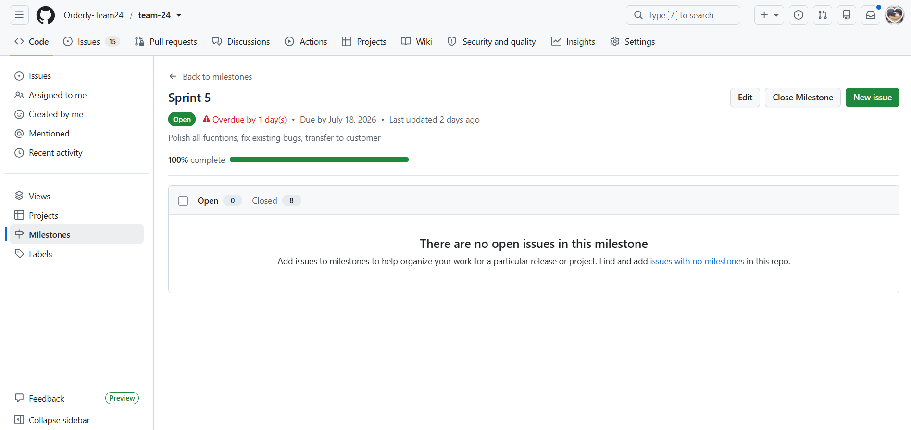
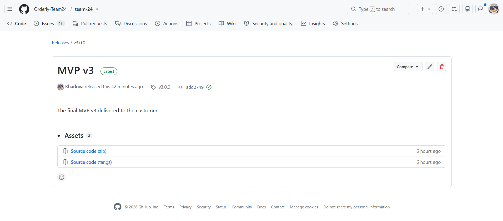
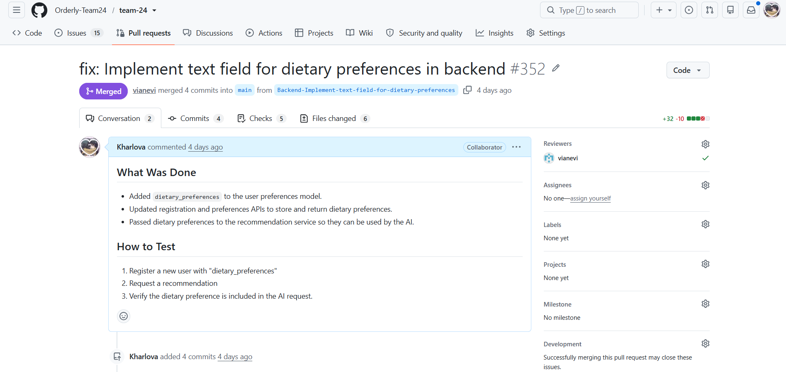
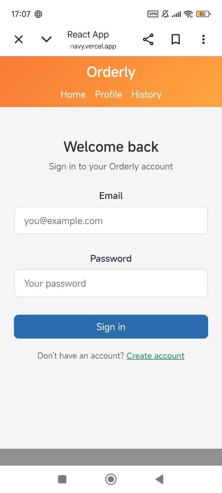

# Week 7 Report – Orderly

## Project information
- **Name:** Orderly – Food Recommendation App
- **Short description:** A web app that helps users choose dishes from restaurant menus based on their preferences and budget.
- **License:** [MIT](../../LICENSE) 

## Previous report
- **README.md from week 6:** [previous report](../week6/README.md)

## Product Backlog
- [Product Backlog board/view](https://github.com/orgs/Orderly-Team24/projects/2)
- [Current Sprint Backlog board/view](https://github.com/orgs/Orderly-Team24/projects/3)
- [Sprint 5 milestone](https://github.com/Orderly-Team24/team-24/milestone/5)

### Sprint Details
- **Sprint Goal:** Polish all fucntions, fix existing bugs, transfer to customer.33
- **Sprint Dates:** July 13 2026 – July 19 2026
- **Scope Summary:** Bug fixes including OCR/menu parsing, database persistence, mobile UI polish, dietary preferences input, user guide, and meal type filtering stabilization. Order history page remains non-functional but is scheduled for immediate fix before Demo Day.
- **Total Sprint Size:** 28 Story Points

## Delivery Summary
- **Week 7 follow-up:** Fixed critical bugs (OCR, database persistence, UI polish, filtering), added user guide, and finalized deployment for customer handover.
- **Access/Run instructions:** [README.md](../../README.md)
- **Deployed Product (runnable artifact):** [product](https://team-24-navy.vercel.app/login)

## Documentation
- **Contributing:** [CONTRIBUTING.md](../../CONTRIBUTING.md)
- **AGENTS.md:** [AGENTS.md](../../AGENTS.md)
- **Customer handover:** [customer-handover.md](../../docs/customer-handover.md)
- **Hosted Documentation Site:** [Orderly Docs](https://orderly-team24.github.io/team-24/)

## Transition & Handover
- **Final transition outcome:** Full handover completed. Customer confirmed product is ready for independent use.
- **Transferred/delegated items:** Repository access granted, [deployed app](https://team-24-navy.vercel.app/login), documentation ([README.md](../../README.md), [CONTRIBUTING.md](../../CONTRIBUTING.md), [AGENTS.md](../../AGENTS.md), [customer handover](../../docs/customer-handover.md)), user guide. Full details in [customer handover](../../docs/customer-handover.md).
- **Remaining support:** Support provided until 31.07.2026. 
- **Remaining limitations:**
  - no password reset, no email verification
  - the app supports only English language
  - the OCR does not support handwritten menus or decorative fonts
  - OCR work depends on menu photo quality
  - free-tier Render instances take 15-30 seconds to wake up
  - Order history page is currently broken. Fix in progress, will be completed before Demo Day
- **Summary of customer-independent us:** Customer independently tried the product during Week 7 meeting and  confirmed handover level as "Ready for independent use".

## Summary of customer-independent use
- Customer independently tested the product during the Week 7 Sprint Review (17.07.2026)
- Customer verified core features: dietary preferences text field, three-column menu handling, meal type filtering, mobile layout, and AI recommendations.
- Customer feedback: positively noted that dietary preferences work as expected, confirmed OCR text extraction works correctly.
- Critical issue identified: order history page is not functional. Team is actively working on the fix and will deliver it before Demo Day.
- Follow-up items requested (all of this alredy done): fix history page, provide full system demo video after fixes, transfer repository ownership.

## Customer Feedback Response (Sprint 5)

| Feedback Point | Status |
|:--- | :--- |
| History page not functional | In progress. Fix planned before Demo Day |
| Provide full system video demonstration after fixes | Completed |
| Transfer repository ownership | Completed |
| Send finalized documentation | Completed |
  
## UAT Results Summary
- **UAT-08 (View Order History and Dislike a Dish)** – failed. History page does not load correctly. Fix is in progress and will be completed before Demo Day.
- **UAT-09 (AI Never Recommends an Excluded or Allergen Food)** – passed. Formal allergies, mood-field exclusions, and Dietary Preferences are all exluded from recommendations.
- **UAT-10 (AI Recognizes Meal Type and Never Recommends a Drink as the Dish)** – passed. AI correctly recommends breakfast/dinner based on request and doesn't returns a drink as the main dish. Meal type filtering instability from Sprint 4 was resolved.

## Release & Changelog
- **CHANGELOG.md:** [CHANGELOG.md](../../CHANGELOG.md) 
- **SemVer Release:** [MVP v3](https://github.com/Orderly-Team24/team-24/releases/tag/v3.0.0)

## Media
- [Demo video](https://www.youtube.com/watch?v=mbJnwMYzU8k)

## Demo Day preparation
- Rehearsal completed in Week 7
- Full product demo prepared covering all MVP v3 features
- Team roles assigned
- Deployment verified

## Sprint Reports & Retrospectives
- **Sprint review transcript:** [sprint-review-transcript.md](sprint-review-transcript.md)
- **Customer Review Summary:** [sprint-review-summary.md](sprint-review-summary.md)
- **Sprint Reflection:** [reflection.md](reflection.md)
- **Retrospective:** [retrospective.md](retrospective.md)
- **LLM Report:** [llm-report.md](llm-report.md)

## Final product status
- MVP v3 is fully delivered and deployed
- All Sprint 5 issues are closed
- Order history page is currently broken. Fix is in progress and will be completed before Demo Day
- The product is stable, customer-approved, and ready for independent use
- Core features (OCR, AI recommendations, dietary preferences, meal filtering, order history with dislike button, mobile-responsive UI) are functional
- Support provided until 31.07.2026.

## Contribution Traceability
| Team Member | Issues | PRs/MRs | Review Activity | Documentation |
| :--- | :--- | :--- | :--- | :--- |
| Daria Gorshkova (dayeon761) | [#340](https://github.com/Orderly-Team24/team-24/issues/340), [#338](https://github.com/Orderly-Team24/team-24/issues/338), [#330](https://github.com/Orderly-Team24/team-24/issues/330) | [#361](https://github.com/Orderly-Team24/team-24/pull/361), [#344](https://github.com/Orderly-Team24/team-24/pull/344), [#343](https://github.com/Orderly-Team24/team-24/pull/343), [#342](https://github.com/Orderly-Team24/team-24/pull/342) | [#360](https://github.com/Orderly-Team24/team-24/pull/360), [#348](https://github.com/Orderly-Team24/team-24/pull/348) | [README.md](../../README.md), [CHANGELOG.md](../../CHANGELOG.md), [docs/user-acceptance-tests.md](../../docs/user-acceptance-tests.md) |
| Viktoriia Iakovleva (rxxtzz) | [#329](https://github.com/Orderly-Team24/team-24/issues/329), [#337](https://github.com/Orderly-Team24/team-24/issues/337) | [#377](https://github.com/Orderly-Team24/team-24/pull/377), [#376](https://github.com/Orderly-Team24/team-24/pull/376), [#375](https://github.com/Orderly-Team24/team-24/pull/375), [#374](https://github.com/Orderly-Team24/team-24/pull/374), [#373](https://github.com/Orderly-Team24/team-24/pull/373), [#372](https://github.com/Orderly-Team24/team-24/pull/372), [#371](https://github.com/Orderly-Team24/team-24/pull/371), [#370](https://github.com/Orderly-Team24/team-24/pull/370), [#369](https://github.com/Orderly-Team24/team-24/pull/369), [#368](https://github.com/Orderly-Team24/team-24/pull/368), [#367](https://github.com/Orderly-Team24/team-24/pull/367), [#366](https://github.com/Orderly-Team24/team-24/pull/366), [#346](https://github.com/Orderly-Team24/team-24/pull/346), [#345](https://github.com/Orderly-Team24/team-24/pull/345) | [#388](https://github.com/Orderly-Team24/team-24/pull/388), [#386](https://github.com/Orderly-Team24/team-24/pull/386), [#385](https://github.com/Orderly-Team24/team-24/pull/385), [#384](https://github.com/Orderly-Team24/team-24/pull/384), [#383](https://github.com/Orderly-Team24/team-24/pull/383), [#382](https://github.com/Orderly-Team24/team-24/pull/382), [#381](https://github.com/Orderly-Team24/team-24/pull/381), [#380](https://github.com/Orderly-Team24/team-24/pull/380), [#379](https://github.com/Orderly-Team24/team-24/pull/379), [#378](https://github.com/Orderly-Team24/team-24/pull/378), [#365](https://github.com/Orderly-Team24/team-24/pull/365), [#363](https://github.com/Orderly-Team24/team-24/pull/363), [#361](https://github.com/Orderly-Team24/team-24/pull/361), [#359](https://github.com/Orderly-Team24/team-24/pull/359), [#347](https://github.com/Orderly-Team24/team-24/pull/347), [#344](https://github.com/Orderly-Team24/team-24/pull/344), [#343](https://github.com/Orderly-Team24/team-24/pull/343), [#342](https://github.com/Orderly-Team24/team-24/pull/342) | final presentation, Moodle PDF, [docs/roadmap.md](../../docs/roadmap.md) |
| Polina Kharlova (Kharlova) | [#331](https://github.com/Orderly-Team24/team-24/issues/331), [#337](https://github.com/Orderly-Team24/team-24/issues/337) | [#353](https://github.com/Orderly-Team24/team-24/pull/353), [#352](https://github.com/Orderly-Team24/team-24/pull/352) | [#364](https://github.com/Orderly-Team24/team-24/pull/364), [#343](https://github.com/Orderly-Team24/team-24/pull/343), [#341](https://github.com/Orderly-Team24/team-24/pull/341) | [images](images) [week 7 README.md](README.md) | 
| Vilena Zulkarnaeva (vianevi) | [#331](https://github.com/Orderly-Team24/team-24/issues/331), [#337](https://github.com/Orderly-Team24/team-24/issues/337) | [#381](https://github.com/Orderly-Team24/team-24/pull/381), [#380](https://github.com/Orderly-Team24/team-24/pull/380), [#379](https://github.com/Orderly-Team24/team-24/pull/379), [#378](https://github.com/Orderly-Team24/team-24/pull/378), [#347](https://github.com/Orderly-Team24/team-24/pull/347) | [#377](https://github.com/Orderly-Team24/team-24/pull/377), [#376](https://github.com/Orderly-Team24/team-24/pull/376), [#375](https://github.com/Orderly-Team24/team-24/pull/375), [#374](https://github.com/Orderly-Team24/team-24/pull/374), [#373](https://github.com/Orderly-Team24/team-24/pull/373), [#372](https://github.com/Orderly-Team24/team-24/pull/372), [#371](https://github.com/Orderly-Team24/team-24/pull/371), [#370](https://github.com/Orderly-Team24/team-24/pull/370), [#369](https://github.com/Orderly-Team24/team-24/pull/369), [#368](https://github.com/Orderly-Team24/team-24/pull/368), [#367](https://github.com/Orderly-Team24/team-24/pull/367), [#366](https://github.com/Orderly-Team24/team-24/pull/366), [#362](https://github.com/Orderly-Team24/team-24/pull/362), [#358](https://github.com/Orderly-Team24/team-24/pull/358), [#357](https://github.com/Orderly-Team24/team-24/pull/357), [#356](https://github.com/Orderly-Team24/team-24/pull/356), [#355](https://github.com/Orderly-Team24/team-24/pull/355), [#354](https://github.com/Orderly-Team24/team-24/pull/354), [#353](https://github.com/Orderly-Team24/team-24/pull/353), [#352](https://github.com/Orderly-Team24/team-24/pull/352), [#346](https://github.com/Orderly-Team24/team-24/pull/346), [#345](https://github.com/Orderly-Team24/team-24/pull/345) |  [sprint-review-summary.md](sprint-review-summary.md), sprint-review-transcript.md](sprint-review-transcript.md), [reflection.md](reflection.md), [retrospective.md](retrospective.md) |
| Omar Nader (Ramy678) | [#328](https://github.com/Orderly-Team24/team-24/issues/328) | [#387](https://github.com/Orderly-Team24/team-24/pull/387), [#360](https://github.com/Orderly-Team24/team-24/pull/360), [#348](https://github.com/Orderly-Team24/team-24/pull/348) | [#344](https://github.com/Orderly-Team24/team-24/pull/344), [#343](https://github.com/Orderly-Team24/team-24/pull/343) |  [llm-report.md](llm-report.md) |
| Adelina Khafizova (adelinamikki) | [#339](https://github.com/Orderly-Team24/team-24/issues/339), [#331](https://github.com/Orderly-Team24/team-24/issues/331) | [#388](https://github.com/Orderly-Team24/team-24/pull/388), [#386](https://github.com/Orderly-Team24/team-24/pull/386), [#385](https://github.com/Orderly-Team24/team-24/pull/385), [#384](https://github.com/Orderly-Team24/team-24/pull/384), [#383](https://github.com/Orderly-Team24/team-24/pull/383), [#382](https://github.com/Orderly-Team24/team-24/pull/382), [#365](https://github.com/Orderly-Team24/team-24/pull/365), [#364](https://github.com/Orderly-Team24/team-24/pull/364), [#363](https://github.com/Orderly-Team24/team-24/pull/363), [#362](https://github.com/Orderly-Team24/team-24/pull/362), [#359](https://github.com/Orderly-Team24/team-24/pull/359), [#358](https://github.com/Orderly-Team24/team-24/pull/358), [#357](https://github.com/Orderly-Team24/team-24/pull/357), [#356](https://github.com/Orderly-Team24/team-24/pull/356), [#355](https://github.com/Orderly-Team24/team-24/pull/355), [#354](https://github.com/Orderly-Team24/team-24/pull/354), [#341](https://github.com/Orderly-Team24/team-24/pull/341) | [#387](https://github.com/Orderly-Team24/team-24/pull/387), [#379](https://github.com/Orderly-Team24/team-24/pull/379) |  [CONTRIBUTING.md](../../CONTRIBUTING.md), [AGENTS.md](../../AGENTS.md), [docs/customer-handover.md](../../docs/customer-handover.md) |

## Visual Evidence
### Sprint Milestone

### Final Release

### Example Reviewed Issue-linked PR/MR

### Deployment

